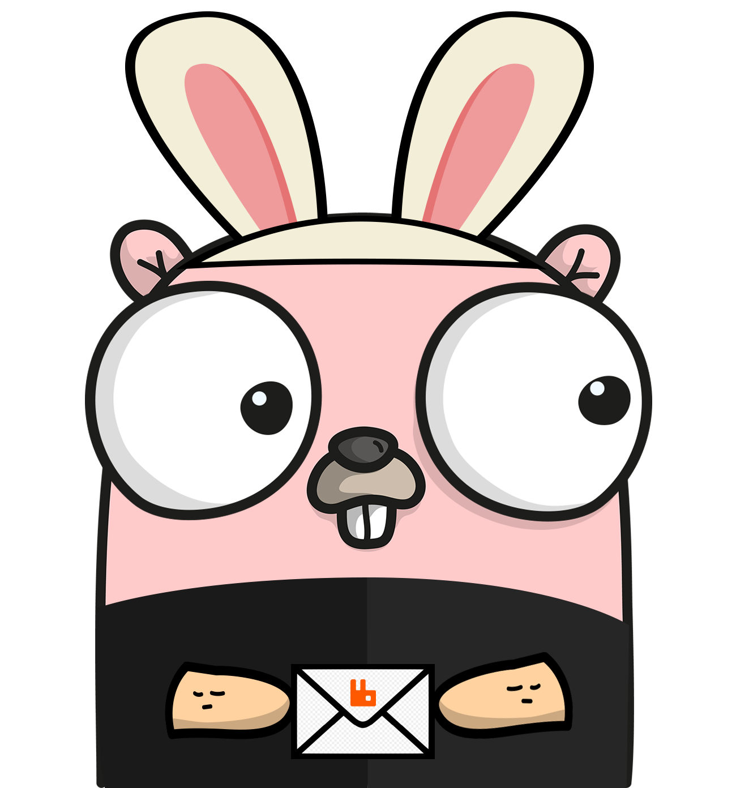

<p align="center"></p>

<h1 align="center">
  go-amqp
</h1>

- [Overview](#overview)
- [Setup](#setup)
- [Starting your client](#starting-your-client)
- [Creating an Exchange](#creating-an-exchange)
- [Creating a Queue](#creating-a-queue)
- [Consuming a Queue](#consuming-a-queue)
- [Pre and Post Handle Functions](#pre-and-post-handle-functions)
- [Creating a Message Publisher](#creating-a-message-publisher)
- [Publishing Messages](#publishing-messages)

## Overview
**go-amqp** is an abstraction layer for the [rabbitmq original library](https://github.com/rabbitmq/amqp091-go).

The rabbitmq original library is a very powerful and capable library.
However, while using the library, we at **delivery-much** realized that it was a little too verbose to use.

The **go-amqp** library aims to facilitate the use of the rabbitmq library, implementing object-oriented interfaces for AMQP elements, making it possible to configure producers and consumers with much less and more readable code.

For instance, let's say you want to define an AMQP exchange and bind a queue to that exchange using the rabbitmq original library.
You would probably do something like this:

```go
conn, err := amqp.DialConfig("my-amqp-url", amqp.Config{})
if err != nil {
  return
}

ch, err := conn.Channel()
if err != nil {
  return
}

// define the exchange
err = ch.ExchangeDeclare(
  "my-exchange",
  "topic",
  true,
  false,
  false,
  true,
)
if err != nil {
  return
}

// define the queue
_, err = ch.QueueDeclare(
  "my-queue",
  true,
  false,
  true,
  true,
)
if err != nil {
  return
}

// bind the queue to the exchange
err = ch.QueueBind(
  "my-queue",
  "my-routing-key",
  "my-exchange",
  false,
)
if err != nil {
  return
}
```

This code is a little messy mainly because:

- It is hard to understand directly the exchange and queue configuration since the configuration values are unnamed booleans ❌
- There are way too many steps in the configuration, and those steps seem a little redundant ❌
- Also, if you wanted to consume messages from that queue, you would need to implement your own consume function ❌

Using the **go-amqp** library, you could do the same thing like this:

```go
// start the client
client, err := goamqp.NewClient("my-amqp-url")
if err != nil {
  return
}

// start the exchange
e, err := client.StartExchange("my-exchange", amqp.ExchangeTypeTopic, amqp.ExchangeConfig{
  Durable: true,
  NoWait: true,
})
if err != nil {
  return
}

// define the queue and bind to the exchange using the routing-key
q, err := e.BindQueue("my-queue", "my-routing-key", amqp.QueueBindConfig{
  Durable: true,
  Exclusive: true,
  NoWait: true,
})
if err != nil {
  return
}
```

This code is a little better because:

- The queue and exchange configurations are received in optional configuration objects, so the values are documented and named, making them easier to read ✅
- The **go-amqp** library uses object orientation (exchanges and queues are defined as objects), so you can define your queues inside an exchange, which makes your code easier to reuse and understand ✅
- The library mitigates many of the steps necessary to declare and consume your queues, making the whole process a lot more friendly ✅

This is just a sample of how the **go-amqp** library was made to make the developers' lives easier. The following topics in the documentation explain the library and its functionalities in much more detail.


## Setup
To download **go-amqp** and add it to your project, just run:

```shell
$ go get github.com/delivery-much/go-amqp
```

And you're good to Go!

## Starting your client

Starting your AMQP client using the **go-amqp** library is pretty easy.
All you need to do is use the `NewClient` function passing your AMQP URL and a configuration.

Ex.:
```go
import (
  goamqp "github.com/delivery-much/go-amqp"
)

func main() {
  cl, err := goamqp.NewClient("my-amqp-url", amqp.Config{})
  if err != nil {
    return
  }
}
```

The `NewClient` function receives an AMQP URL and a configuration object. 
The expected configuration object is the same as the [Config object for the rabbitmq original library](https://github.com/rabbitmq/amqp091-go/blob/main/connection.go#L42),
enabling the user to add extra configuration to the client connection.

The client represents the starting point for your AMQP configuration. It's the connection between your project and your AMQP server.

From the client you can:

- `Ping` the server:
```go
import (
  goamqp "github.com/delivery-much/go-amqp"
)

func main() {
  cl, err := goamqp.NewClient("my-amqp-url", goamqp.Config{})
  if err != nil {
    return
  }

  err = cl.Ping()
  if err != nil {
    fmt.Printf("AMQP client offline... %v\n", err)
    return
  }

  fmt.Println("AMQP client online!")
}
```

- `Close` the connection:
```go
import (
  goamqp "github.com/delivery-much/go-amqp"
)

func main() {
  cl, err := goamqp.NewClient("my-amqp-url", goamqp.Config{})
  if err != nil {
    return
  }

  err = cl.Close()
  if err != nil {
    fmt.Printf("Failed to close the AMQP client... %v\n", err)
    return
  }

  fmt.Println("AMQP client closed!")
}
```

- And you can also create `exchanges` and `queues` to consume messages and `producers` to send messages, but more on that later.


## Creating an exchange
After you have [created your client](#starting-your-client), you can use the client's connection to create an exchange, using the `StartExchange` function.

Ex.:
```go
import (
  goamqp "github.com/delivery-much/go-amqp"
)

func main() {
  cl, err := goamqp.NewClient("my-amqp-url", goamqp.Config{})
  if err != nil {
    return
  }

  e, err := client.StartExchange("my-exchange", goamqp.ExchangeTypeTopic, goamqp.ExchangeConfig{
    Durable: true,
    NoWait: true,
  })
  if err != nil {
    return
  }
}
```

The `StartExchange` function receives:
- The exchange name.
- The exchange type, which you can use one of the `ExchangeType` enums that **go-amqp** provides or use a string directly.
- The exchange configuration object, which contains many available AMQP configuration values. (optional)

It returns the exchange object and an error if anything went wrong.

In the **go-amqp** library, exchanges are treated as objects. Each exchange instance has its own channel to publish messages. 
So, in a way, each exchange declaration is an instantiation of a communication channel between your project and the AMQP client.

If you desire multiple channels to handle concurrency, you can instantiate the same exchange more than once to create different channels.

## Creating a queue
After you have [started your exchange](#creating-an-exchange), you can use the exchange to define queues, using the `BindQueue` function.

Ex.:
```go
import (
  goamqp "github.com/delivery-much/go-amqp"
)

func main() {
  cl, err := goamqp.NewClient("my-amqp-url", goamqp.Config{})
  if err != nil {
    return
  }

  e, err := client.StartExchange("my-exchange", goamqp.ExchangeTypeTopic, goamqp.ExchangeConfig{
    Durable: true,
    NoWait: true,
  })
  if err != nil {
    return
  }

  q, err := e.BindQueue("my-queue", "my-routing-key", goamqp.QueueBindConfig{
    Durable: true,
    Exclusive: true,
    NoWait: true,
  })
  if err != nil {
    return
  }
}
```

The `BindQueue` function receives:

- The queue name.
- The routing-key, which can be sent as an empty string (`""`) if you do not want to bind the queue using a routing-key.
- The queue configuration object, which contains various available AMQP configuration values (optional).

**go-amqp** assumes that when you want to declare a queue, you intend to consume messages from that queue. Therefore, the queue needs to be bound to an exchange.

As a result, when you declare a queue using the **go-amqp** library, you declare and bind it directly inside an exchange, using the exchange's channel. 
This streamlined approach greatly simplifies the process required to declare and consume a queue.

As mentioned earlier, each exchange has its channel. 
If you desire multiple channels to handle concurrency, you can instantiate the same exchange and queues more than once to create different channels.


## Consuming a queue
After you [declared your queues](#creating-a-queue), consuming messages becomes pretty easy.

All you need to do is use the `Consume` function to define the function that will be called when a message is received on that queue.
But first, you need to define your handler function.

Handler function are functions that can be used to handle the amqp messages that are received on a queue.
They have the following contract:
```go
type HandlerFunc func(context.Context, Delivery) HandleResponse
```

They receive the message handling context and the amqp message Delivery, and return a `HandleResponse`.

The `HandleResponse` its an object that is used to tell the **go-amqp** library if the message handling was successfull or not, and if the message should be requeued or not.

```go
// HandleResponse represents the response when handling a message
type HandleResponse struct {
	// Nack defines if the message should NOT be acknowledged, and should be requeued (default: false)
	Nack bool
	// Err is the error that could have occurred during the message handling (default: nil)
	Err error
}
```

Every time that a message is received on the specified queue, 
the **go-amqp** library will create an new empty context, and call the `HandlerFunc` provided using the context and the AMQP message.
When the function finishes, the library will deal with the response accordingly.


Ex.:
```go
import (
  goamqp "github.com/delivery-much/go-amqp"
)

func myHandlerFunction(ctx context.Context, d goamqp.Delivery) (res goamqp.HandleResponse) {
  fmt.Printf("Received Message: %s\n", d.MessageId)

  return
}

func main() {
  cl, err := goamqp.NewClient("my-amqp-url", goamqp.Config{})
  if err != nil {
    return
  }

  e, err := client.StartExchange("my-exchange", goamqp.ExchangeTypeTopic, goamqp.ExchangeConfig{
    Durable: true,
    NoWait: true,
  })
  if err != nil {
    return
  }

  q, err := e.BindQueue("my-queue", "my-routing-key", goamqp.QueueBindConfig{
    Durable: true,
    Exclusive: true,
    NoWait: true,
  })
  if err != nil {
    return
  }

  err = q.Consume(myHandlerFunction, goamqp.ConsumeConfig{
    ConsumerName: "my-consumer",
  })
  if err != nil {
    return
  }
}
```

The consume function receives:
- The `HandlerFunction`.
- The consume configuration object, which contains various available AMQP configuration values, including the consumer name (optional).

And returns an error if anything goes wrong.

## Pre and post handle functions

The primary objective of the **go-amqp** library is to enhance the clarity and cleanliness of your AMQP code.
To achieve this, several features have been integrated to empower developers in the effective handling of AMQP messages.

One of the core features of the library is the inclusion of Pre and Post handling functions.

Pre-handle functions are designed to execute **before** the main `HandlerFunction` is invoked.
They have the following contract:

```go
type PreHandleFunc func(*context.Context, *Delivery)
```

Similar to the `HandlerFunction`, `PreHandleFunc`s receive the message handling context and the message Delivery.
However, they receive a **pointer** to those values, so the developer can alter the message handling context and even the message itself before handling it.

Post-handle functions are designed to execute **after** the main `HandlerFunction` is invoked.
They have the following contract:

```go
type PostHandleFunc func(context.Context, Delivery, HandleResponse)
```

Similar to the `HandlerFunction`, `PostHandleFunc`s receive the message handling context and the message Delivery.
However, they also receive the `HandleResponse` that the main `HandlerFunction` returned.

Both the `exchanges` and `queues` have the `Before` and `After` functions,
that can be used to define `PostHandleFunc`s and `PreHandleFunc`s to be called in the exchange or queue context.

When you define Pre or Post handle functions for an `exchange`, every queue associated with that exchange instance will invoke these functions.

On the other hand, when you define Pre or Post handle functions for a specific `queue`, only that particular queue will execute these designated functions.


Ex.:
```go
import (
  "fmt"
  "context"
  goamqp "github.com/delivery-much/go-amqp"
)

func myHandlerFunction(ctx context.Context, d goamqp.Delivery) (res goamqp.HandleResponse) {
  fmt.Printf("Received Message: %s\n", d.MessageId)

  return
}

func preHandleFunction(ctx *context.Context, d *goamqp.Delivery) {
  *ctx = context.WithValue(*ctx, "id", "my handling id")
}

func postHandleFunction(ctx context.Context, d Delivery, res HandleResponse) {
  if res.Err != nil {
    fmt.Printf("Message with id %s failed to consume, %v\n", d.MessageId, res.Err)
  }
}

func main() {
  cl, err := goamqp.NewClient("my-amqp-url", goamqp.Config{})
  if err != nil {
    return
  }

  e, err := client.StartExchange("my-exchange", goamqp.ExchangeTypeTopic, goamqp.ExchangeConfig{
    Durable: true,
    NoWait: true,
  })
  if err != nil {
    return
  }

  e.Before(preHandleFunction) // preHandleFunction will be called before all the messages received on the exchange

  q, err := e.BindQueue("my-queue", "my-routing-key", goamqp.QueueBindConfig{
    Durable: true,
    Exclusive: true,
    NoWait: true,
  })
  if err != nil {
    return
  }

  q.After(postHandleFunction) // postHandleFunction will be called only after the messages received on this queue

  err = q.Consume(myHandlerFunction, goamqp.ConsumeConfig{
    ConsumerName: "my-consumer",
  })
  if err != nil {
    return
  }
}
```

## Creating a message publisher

Creating a message publisher using the **go-amqp** library is really easy.

This library assumes that, when you want to publish a message, all you need is the exchange name (and a routing-key, if necessary).
So using this line of thought, the process to create a publisher is really simplified.

After you have [started your client](#starting-your-client), you can use the `CreatePublisher` function to start a new publisher.

Ex.:
```go
import (
  goamqp "github.com/delivery-much/go-amqp"
)

func main() {
  cl, err := goamqp.NewClient("my-amqp-url", goamqp.Config{})
  if err != nil {
    return
  }

  pub, err := cl.CreatePublisher("my-exchange-name", false)
  if err != nil {
    return
  }
}
```

To create a publisher, all you need to do is specify the name of the exchange to which you want to publish messages. 
Every publisher instance will establish a new channel between your project and the AMQP server for message publication.

Additionally, there is an optional boolean value called `NoWait` that you can specify to manage message synchrony.

When you publish a message on the AMQP server, the client usually doesn't wait for a confirmation that the publishing was successful.

By setting the `NoWait` flag to `false`, the publishing channel will be created in **confirmation mode**, meaning the publisher will be able to wait for a confirmation from the server after a message is published.

On the other hand, when the `NoWait` flag is set to `true`, the publishing channel will not be able to wait for a confirmation from the server.

The default value for the `NoWait` flag is `false`.

Please note that not all AMQP servers support **confirmation mode**, so you may need to set the `NoWait` flag to `true`.


## Publishing messages

After you have [created your publisher](#creating-a-message-publisher), you can use the `Publish` function to publish messages on the AMQP server.

Ex.:
```go
import (
  goamqp "github.com/delivery-much/go-amqp"
)

func main() {
  cl, err := goamqp.NewClient("my-amqp-url", goamqp.Config{})
  if err != nil {
    return
  }

  pub, err := cl.CreatePublisher("my-exchange-name", false)
  if err != nil {
    return
  }

  message := goamqp.Publishing{
    Body: []byte("my message!"),
  }

  err = pub.Publish(message, "my-routing-key", goamqp.PublishConfig{
    WaitConfirmation: true,
  })
  if err != nil {
    return
  }
}
```

The publishing action receives the following parameters:
- The message to publish, which is a struct that follows the [RabbitMQ original library Publishing struct](https://github.com/rabbitmq/amqp091-go/blob/main/types.go#L159).
- The routing key used to route the message. If no routing key is necessary, you can set this value as `""`.
- An optional publish configuration. In this configuration, you can use the `WaitConfirmation` flag to make the message publishing process wait for a confirmation from the server if your [publisher was created in confirmation mode](#creating-a-message-publisher).
